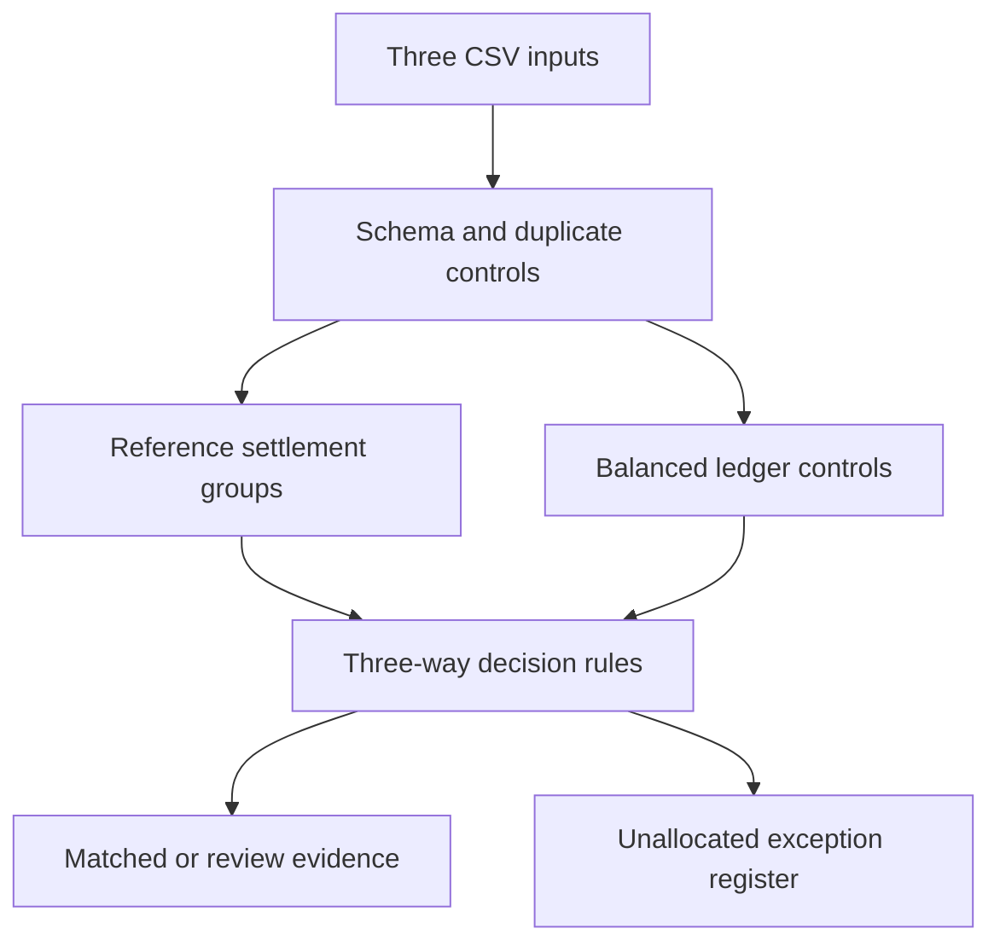

# Financial Reconciliation & Controls Engine

**Three sources. One explainable settlement view.**

A local financial-operations workbench that reconciles bank movements, open
invoices and double-entry journal records. Built by **Murat Miraç Gedik**.

[](https://github.com/muratmiracg-dev/financial-reconciliation-controls-engine/actions)

[Türkçe](README.tr.md) · [Data contract](docs/DATA_CONTRACT.md) · [Methodology](docs/METHODOLOGY.md) · [Validation](docs/VALIDATION.md)

## Business question
Which cash movements are supported by invoices and balanced accounting records,
and which differences should finance investigate before closing the period?

## Run in one command
Requires Python 3.11 or newer. **No external Python dependencies, database, API key
or cloud account required.** Download the repository ZIP and extract it, then:

```bash
python app.py
```

Open **http://127.0.0.1:8765**. Click **Load synthetic demo** or upload three CSVs.
On Windows, `py app.py` is an alternative when `python` is unavailable.
The workbench processes data on your computer and does not persist uploads.
GitHub stores the source; this is not a publicly hosted web service.

## Implemented capabilities
- Explicit-reference 1:1, split, batch and connected group reconciliation.
- Exact minor-unit arithmetic with configurable date and amount tolerances.
- Three-way controls: invoices, bank cash and balanced ledger cash lines.
- Conservative handling of duplicates, ambiguity, missing ledger and bad references.
- Fee explanation, partial/overpayment differences and open-invoice exceptions.
- Description similarity for unique unreferenced 1:1 review suggestions.
- Searchable settlement table, status filters, drill-down and per-currency exposure.
- Downloadable CSV settlement report and JSON evidence with input SHA-256 hashes.
- Local-only HTTP application, strict input validation, protected CSV exports.
- Automated regression tests and GitHub Actions verification.

## Reproducible demo
The small benchmark is intentionally auditable rather than inflated with repeated
rows. All parties, records and results are synthetic.

| Evidence | Result |
|---|---:|
| Bank movements | 53 |
| Open invoices | 53 |
| Journal lines | 105 |
| Matched settlement groups | 43 |
| Review settlement groups | 6 |
| Control exception records | 8 |
| Bank-level fixture status agreement | 53 / 53 |

Groups and exception records are different units and may overlap. Fixture agreement
is a controlled regression result, **not real-world model accuracy**. There is no
trained ML model; match strength is an explained heuristic.

## CLI and exports
```bash
python -m reconcile --demo --output output
python -m reconcile --input data/demo --output output --days 45 --tolerance 1
python -m unittest discover -s tests -v
```
CLI writes `report.json` and `settlements.csv`. Demo mode also writes a benchmark
summary. Export amounts are **integer minor units**. UI amounts are formatted in
major units. Custom input folders use bank.csv, invoices.csv and journal.csv.

## How to inspect the demo
1. Load the demo and compare matched versus unresolved amounts by currency.
2. Inspect `B041/B042` for a split payment and `B043` for a batch settlement.
3. Filter REVIEW: `B044` has a fee, `B045` is partial, `B046/B047` are duplicate suspects.
4. Inspect `B048` for missing ledger and `B049` for an unreferenced suggestion.
5. Review the ambiguous `B050` and open invoices in the exception register.
6. Export JSON for the exact rules, policy, input hashes and evidence.

## Design


| Path | Purpose |
|---|---|
| `reconcile/engine.py` | Validation, controls, deterministic matching and exports |
| `reconcile/demo.py` | Synthetic fixtures with independent expected labels |
| `app.py`, `web/` | Loopback server and responsive workbench |
| `tests/` | Monetary, allocation, ambiguity, input and HTTP regression tests |
| `data/demo/` | Ready-to-upload CSVs and truth labels |
| `artifacts/` | Committed synthetic run evidence |
| `docs/` | Methodology, data contract and validation |

## Boundaries
A `MATCHED` result is an analytical finding, not posting authorization. The app
cannot execute payments, change an ERP or approve a close. Real source data needs
normalization to the documented schema. No FX conversion or arbitrary bank-file
parsing is provided. Unreferenced split/batch payments require manual investigation.
The JSON is an exportable evidence snapshot, not a persistent case-management or
immutable audit system. The local server is not hardened for public deployment.

Future extensions: bank-specific adapters, reviewer decisions with durable audit
history, scalable matching and database-backed case management.

MIT licensed. See [SECURITY.md](SECURITY.md) for reporting and data-handling guidance.
