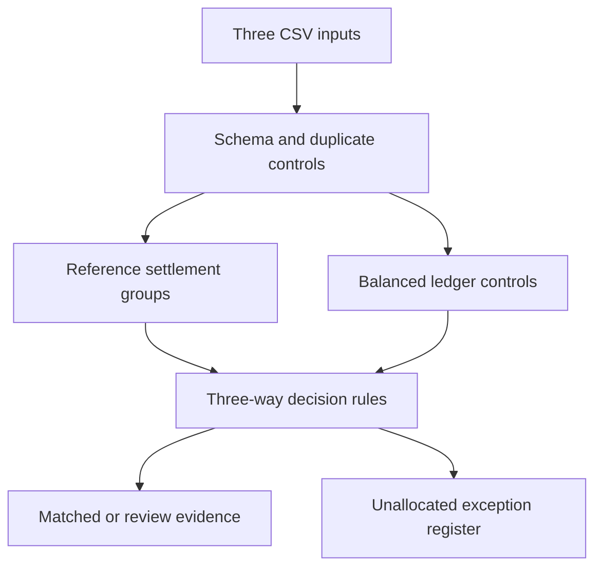

# Financial Reconciliation & Controls Engine

**Three sources. One explainable settlement view.**

A local financial-operations workbench that reconciles bank movements, open
invoices and double-entry journal records. Built by **Murat Miraç Gedik**.

[](https://github.com/muratmiracg-dev/financial-reconciliation-controls-engine/actions)

[Türkçe](README.tr.md) · [Data contract](docs/DATA_CONTRACT.md) · [Methodology](docs/METHODOLOGY.md) · [Validation](docs/VALIDATION.md)

## Business question
Which cash movements are supported by invoices and balanced accounting records,
and which differences should finance investigate before closing the period?

## Run in one command
Requires Python 3.11 or newer. **No external Python dependencies, database, API key
or cloud account required.** Download the repository ZIP and extract it, then:

```bash
python app.py
```

Open **http://127.0.0.1:8765**. Click **Load synthetic demo** or upload three CSVs.
On Windows, `py app.py` is an alternative when `python` is unavailable.
The workbench processes data on your computer and does not persist uploads.
GitHub stores the source; this is not a publicly hosted web service.

## Implemented capabilities
- Explicit-reference 1:1, split, batch and connected group reconciliation.
- Exact minor-unit arithmetic with configurable date and amount tolerances.
- Three-way controls: invoices, bank cash and balanced ledger cash lines.
- Conservative handling of duplicates, ambiguity, missing ledger and bad references.
- Fee explanation, partial/overpayment differences and open-invoice exceptions.
- Description similarity for unique unreferenced 1:1 review suggestions.
- Searchable settlement table, status filters, drill-down and per-currency exposure.
- Downloadable CSV settlement report and JSON evidence with input SHA-256 hashes.
- Local-only HTTP application, strict input validation, protected CSV exports.
- Automated regression tests and GitHub Actions verification.

## Reproducible demo
The small benchmark is intentionally auditable rather than inflated with repeated
rows. All parties, records and results are synthetic.

| Evidence | Result |
|---|---:|
| Bank movements | 53 |
| Open invoices | 53 |
| Journal lines | 105 |
| Matched settlement groups | 43 |
| Review settlement groups | 6 |
| Control exception records | 8 |
| Bank-level fixture status agreement | 53 / 53 |

Groups and exception records are different units and may overlap. Fixture agreement
is a controlled regression result, **not real-world model accuracy**. There is no
trained ML model; match strength is an explained heuristic.

## CLI and exports
```bash
python -m reconcile --demo --output output
python -m reconcile --input data/demo --output output --days 45 --tolerance 1
python -m unittest discover -s tests -v
```
CLI writes `report.json` and `settlements.csv`. Demo mode also writes a benchmark
summary. Export amounts are **integer minor units**. UI amounts are formatted in
major units. Custom input folders use bank.csv, invoices.csv and journal.csv.

## How to inspect the demo
1. Load the demo and compare matched versus unresolved amounts by currency.
2. Inspect `B041/B042` for a split payment and `B043` for a batch settlement.
3. Filter REVIEW: `B044` has a fee, `B045` is partial, `B046/B047` are duplicate suspects.
4. Inspect `B048` for missing ledger and `B049` for an unreferenced suggestion.
5. Review the ambiguous `B050` and open invoices in the exception register.
6. Export JSON for the exact rules, policy, input hashes and evidence.

## Design


| Path | Purpose |
|---|---|
| `reconcile/engine.py` | Validation, controls, deterministic matching and exports |
| `reconcile/demo.py` | Synthetic fixtures with independent expected labels |
| `app.py`, `web/` | Loopback server and responsive workbench |
| `tests/` | Monetary, allocation, ambiguity, input and HTTP regression tests |
| `data/demo/` | Ready-to-upload CSVs and truth labels |
| `artifacts/` | Committed synthetic run evidence |
| `docs/` | Methodology, data contract and validation |

## Boundaries
A `MATCHED` result is an analytical finding, not posting authorization. The app
cannot execute payments, change an ERP or approve a close. Real source data needs
normalization to the documented schema. No FX conversion or arbitrary bank-file
parsing is provided. Unreferenced split/batch payments require manual investigation.
The JSON is an exportable evidence snapshot, not a persistent case-management or
immutable audit system. The local server is not hardened for public deployment.

Future extensions: bank-specific adapters, reviewer decisions with durable audit
history, scalable matching and database-backed case management.

MIT licensed. See [SECURITY.md](SECURITY.md) for reporting and data-handling guidance.

## Matching decision guide

| Situation | Engine behavior | Finance follow-up |
|---|---|---|
| Exact referenced payment | MATCHED if ledger and other controls pass | Confirm operational context |
| One invoice, several receipts | Collect connected references into an N:1 group | Inspect the complete installment window |
| One receipt, several invoices | Compare the referenced invoice total | Check remittance advice |
| Partial or excess payment | REVIEW with signed amount difference | Investigate remaining balance or overpayment |
| Fee-supported shortfall | REVIEW with fee explanation | Confirm approved fee accounting |
| Duplicate business fields | Quarantine all suspected copies | Identify the genuine source record |
| Missing / unbalanced ledger | REVIEW even when invoice and bank agree | Correct or complete ledger evidence |
| Unique unreferenced candidate | REVIEW with heuristic strength | Obtain a reliable invoice reference |
| Multiple candidate matches | Leave unallocated; emit ambiguity exception | Resolve manually using external evidence |
| Unknown explicit reference | REVIEW; no speculative fallback | Repair reference mapping |

### A worked accounting example
An invoice has an open receivable of TRY 10,000. A TRY 9,975 receipt arrives after a
TRY 25 fee. The journal has BANK debit 9,975, FEE debit 25 and AR credit 10,000.
The entry balances and the BANK line agrees with cash. The invoice/cash difference
is still -25, so the result is REVIEW with `FEE_EXPLAINS_DIFFERENCE`. This preserves
the distinction between an explained difference and an approved adjustment.

## Input preparation

| Input | Required header |
|---|---|
| Bank | `id,date,party,currency,amount,reference,description` |
| Invoices | `id,date,party,currency,amount,description` |
| Journal | `id,entry_id,date,bank_id,account,currency,debit,credit` |

Use UTF-8 CSV with decimal points and ISO dates (`2026-09-05`). Party IDs must be
normalized and identical across inputs. Invoice amounts represent **open balances
at the beginning of the supplied window**. Positive amounts mean receivables or
cash inflows; negative amounts mean payables or outflows. A bank reference can list
several invoice IDs separated by semicolons. Journal IDs identify individual lines;
entry_id groups the balanced posting. BANK and FEE are normalized account roles.

Supported currencies are TRY, USD, EUR and GBP. There is no cross-currency netting.
Up to 10,000 rows per input and 500 characters per field are accepted. The browser
limits each file to 2 MB; the server limits the total request to 8 MB. This is a
small-extract workbench; matching unreferenced candidates can be quadratic.

### Policy controls
- **Date window:** absolute calendar-day distance; 45 days by default, 0–365 allowed.
- **Amount tolerance:** integer minor units; 1 by default, 0–100 allowed.
- **Ledger amount:** exact equality, independent of invoice matching tolerance.
- **Group matching:** every bank/invoice pair must pass the date window.
- **Score:** reference strength 100, or 70–90 for an unreferenced suggestion; never
  interpreted as probability, and never allowed to override a failed control.

## Reading the output
`report.json` contains run identity, engine version, policy, input hashes, source
row counts, settlement groups, per-currency totals and the exception register.
`settlements.csv` contains group IDs, statuses, references, differences and reason
codes. It does not contain the full exception register; use JSON for that evidence.

Matched and unresolved gross totals use absolute bank amounts. Net totals retain
cash direction. Neither unresolved gross nor invoice/cash difference is a loss
estimate. Exceptions can overlap; adding exception counts to review-group counts
would double-count cases. A hash identifies an input snapshot, not an anonymized
or tamper-proof archive.

## Technology and skills demonstrated

| Layer | Implementation | Skill demonstrated |
|---|---|---|
| Matching | Python standard library, Decimal, connected reference groups | Financial logic and conservative allocation |
| Evidence | SHA-256, deterministic JSON, CSV | Reproducibility and control traceability |
| Application | Local Python HTTP server, JavaScript, HTML, CSS | End-to-end analytical delivery |
| Controls | Schema, amount, currency, date, duplicate and ledger validation | Data quality and financial control design |
| Delivery | unittest, CI matrix, CodeQL, Dependabot | Regression testing and maintenance |

## Security and repository maintenance
The application binds only to 127.0.0.1, checks Host/Origin, returns a restrictive
Content Security Policy, and renders supplied strings as text. Uploads are processed
in memory. Downloaded reports remain sensitive if real data was supplied.

CI runs with read-only contents permission. Actions are pinned to commit SHAs and
checkout does not retain Git credentials. CodeQL scans Python and JavaScript in
separate jobs with security-extended queries; only those jobs receive permission
to upload security findings. Dependabot tracks GitHub Actions updates. CODEOWNERS
identifies maintainers; enforcement requires repository branch/ruleset settings.

Repository settings such as secret scanning, push protection, private vulnerability
reporting and branch protection are separate from committed workflow files. Their
presence must be verified in GitHub Settings; this README does not imply that all
administrative switches are enabled. See [Security policy](SECURITY.md).

## Troubleshooting

| Symptom | What to check |
|---|---|
| `python` is not found | Install Python 3.11+; on Windows try `py app.py` |
| Browser cannot connect | Keep the terminal running and use exactly `http://127.0.0.1:8765` |
| Port already in use | Stop the earlier instance before starting another |
| Schema error | Compare the header with the downloadable sample; remove extra columns |
| Amount rejected | Remove thousands separators; use a decimal point and at most two decimals |
| Unexpected open invoices | Check extract dates, beginning open balances and missing references |
| Ledger mismatch | Inspect BANK role, currency, bank_id, entry balance and dates |
| Same run gets another ID | Raw CSV bytes or policy changed; whitespace also changes input hashes |

## Validation and honest limitations
30 automated tests exercise matching, monetary calculations, data validation and
HTTP security boundaries. The fixture output is compared byte-for-byte in CI.
JavaScript syntax is checked independently. Full browser visual testing was blocked
by a Chromium download failure in the original build environment; no browser-test
success or production-readiness claim is made. See [validation notes](docs/VALIDATION.md).

## Contributing
Use synthetic reproductions only. Open a branch, explain the financial behavior
being changed, run the regression suite and submit a pull request. Include a test
when changing matching or security behavior. Never attach real bank extracts,
customer identifiers, credentials or confidential ledger data to public issues.
